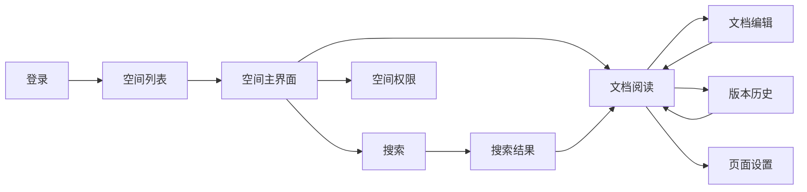

# 保真原型 — 页面清单与站点地图（0.7–0.8）

## 0.7 原型覆盖的页面范围

以下与《05-项目实施计划》中「必须覆盖的页面」一致，并标注了**演示主路径必需**与**次要/可选**，便于安排原型优先级。

| 编号 | 页面 | 优先级 | 说明 |
|------|------|--------|------|
| 0.9 | 登录页 | **必需** | 主流程起点 |
| 0.10 | 首页 / 空间列表 | **必需** | 登录后首屏，展示有权限的空间 |
| 0.11 | 空间主界面（三栏） | **必需** | 进入空间后的主框架，左树+中内容+右栏 |
| 0.12 | 文档阅读页 | **必需** | 点击树节点后的阅读态，含面包屑、编辑入口 |
| 0.13 | 文档编辑页 | **必需** | 编辑态、工具栏、保存状态 |
| 0.14 | 版本历史 | **必需** | 体现「知识可追溯」，汇报易加分 |
| 0.15 | 搜索结果 | 次要 | 体现检索能力，时间紧可简化 |
| 0.16 | 空间权限配置 | 次要 | 体现管理能力，可选在汇报末尾带过 |
| 0.17 | 页面设置/页面级权限 | 可选 | 若有篇幅再做，否则口头说明「支持页面级权限」即可 |
| 0.18 | 空间管理（System admin） | 可选 | 体现只有系统管理员可以创建/维护 Space，本次以简洁列表页 `admin-spaces` 展示即可 |

**建议制作顺序**：0.9 → 0.10 → 0.11 → 0.12 → 0.13 → 0.14 → 0.15 → 0.16 →（0.17 可选）。

---

## 0.8 站点地图 / 页面流转图

### 方式一：层级结构

```
登录
 └── 首页（空间列表）
       └── 空间主界面（三栏）
             ├── 文档阅读（点击树节点）
             │     ├── 编辑 → 文档编辑
             │     │     └── 保存 → 回到文档阅读（或自动刷新）
             │     └── 版本历史（侧栏/弹窗）
             │           └── 回滚 → 确认 → 文档阅读更新
             ├── 新建页面 → 文档编辑（空白）→ 保存 → 树中多一新节点
             └── 搜索（顶栏/侧栏）→ 搜索结果 → 点击某条 → 文档阅读

空间主界面内（管理员）
 └── 空间设置/权限 → 空间权限配置页
        └── 保存 → 返回或提示成功

系统管理员后台
 └── 空间管理列表（admin-spaces）→ New space（prototype 占位）

文档阅读/编辑内（可选）
 └── 页面设置 → 页面级权限弹窗
        └── 保存 → 关闭弹窗
```

### 方式二：Mermaid 流程图（可放入 PPT 或原型说明）



### 方式三：演示路径（汇报时按此顺序点击）

1. 登录  
2. 空间列表 → 点击某一空间  
3. 空间主界面 → 点击左侧某页面（或「新建页面」）  
4. 文档阅读 → 点击「编辑」  
5. 文档编辑 → 展示工具栏与保存状态 → 保存/自动保存  
6. 返回阅读 → 打开「版本历史」→ 选一版预览 → 回滚（可仅展示到确认前）  
7. 顶栏「搜索」→ 输入关键词 → 搜索结果 → 点击一条进入阅读  
8. （可选）空间设置 → 空间权限配置 → 保存  

---

完成页面范围确认与站点地图后，可在《05-保真原型Todo清单》中将 0.7、0.8 勾选为已完成，并开始第四块「必须覆盖的页面」的原型绘制（0.9–0.17）。
